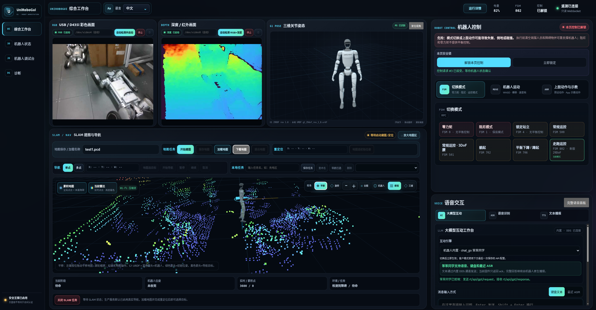
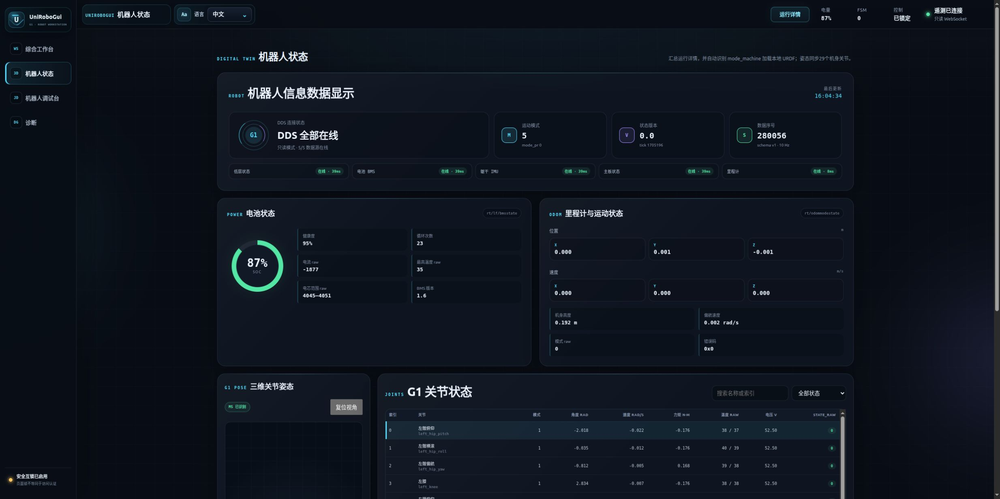
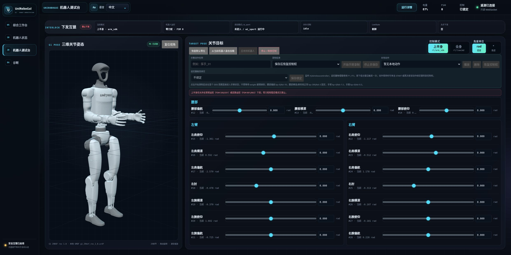
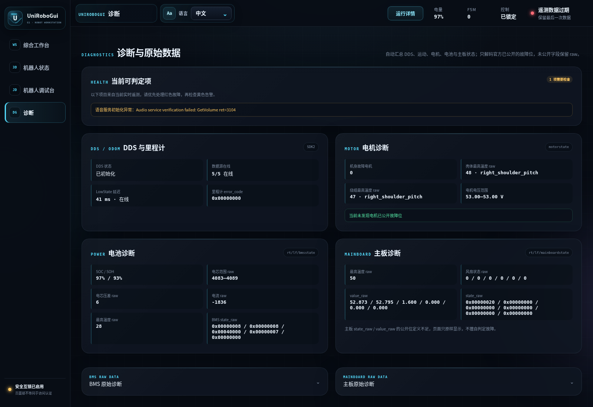

# UniRoboGui — Unitree G1 Web GUI & SDK2 Robot Development Dashboard

[简体中文](README.md) | **English**

> **An open-source Web GUI, SDK2 dashboard, and development/debugging platform for the Unitree G1 EDU humanoid robot** — bringing robot telemetry, control, perception, SLAM, navigation, joints, cameras, voice, and LLM capabilities into one browser workspace.

**UniRoboGui** runs directly on the **Unitree G1 PC2** and uses **C++17 + Unitree SDK2 DDS** to expose robot capabilities through a browser-based interface for real-time monitoring, control, visualization, and debugging. It is intended for developers looking for a **Unitree G1 Web interface / robot dashboard**, a faster way to validate SDK2 APIs, or a reusable foundation for higher-level robot applications.

Unitree SDK2 provides rich low-level capabilities, but real projects still need to combine data channels, service APIs, examples, and sensor pipelines. UniRoboGui turns that repeated integration work into an observable, debuggable, and reusable engineering layer so developers can move faster from “getting the SDK working” to robot feature validation and application development.

Typical use cases include a **Unitree G1 Web GUI, Unitree SDK2 DDS telemetry / robot control, SLAM mapping & navigation, Livox Mid-360 point-cloud visualization, Intel RealSense D435i RGB / depth streaming, 29-DoF URDF / joint debugging**, and **ASR / TTS / LLM / OpenAI-compatible API** integration.

### Core capabilities

- **Unified SDK2 capability access**: connects directly to Unitree SDK2 DDS and brings LowState, BMS, dual IMU, odometry, FSM, 29-joint telemetry, and official control/service capabilities into one project and interface.
- **Integrated debugging and visualization**: view robot state, D435i RGB/depth streams, the live G1 3D pose, Mid-360 point cloud, SLAM map, navigation, control state, and voice interaction in one browser workspace instead of switching between separate tools.
- **Perception, mapping, and navigation pipeline**: provides live point cloud, accumulated map, robot track, occupancy voxels, mapping, map save/load/download, initial-pose setting, single/multi-point navigation, and reusable local navigation tasks.
- **Joint debugging and action development**: includes live 29-DoF URDF visualization, upper/full-body joint debugging, 20 Hz hand-guided teaching, local action playback with hold/release behavior, and G1 remote-control key binding.
- **Voice and LLM integration**: combines ASR, Unitree native TTS, local Kokoro Chinese/English TTS, the robot's built-in LLM, and customer OpenAI-compatible APIs with role prompts, fixed Q&A, and wake phrases.
- **A foundation for further development**: provides Chinese/English UI, online/offline automated deployment, Mock regression mode, and control safety interlocks, making it suitable as a base environment for robot feature validation, field debugging, and higher-level application development.

> **Ready to deploy?** Jump to [Quick deployment](#quick-deployment).
>
> Both deployment cases are supported: the robot can access GitHub, or the robot is offline while another Ubuntu/Linux computer has Internet access.

---

## 1. Interface preview

The screenshots below come from a real UniRoboGui deployment. Values can vary with robot firmware, hardware revision, display size, and connected sensors.

### 1.1 Integrated workstation



The integrated workstation is the main page for demonstrations, debugging, and field operation.

It can:

- show D435i RGB and depth streams, with independent enlarged views;
- render the G1 29-DoF model and follow the real joint state;
- display Mid-360 live point cloud, accumulated map, robot path, and navigation goals;
- start mapping, save/load maps, set initial pose, and run single-point or multi-point navigation;
- save frequently used navigation tasks for later reuse;
- display the current control state and expose supported motion modes, keyboard motion, and upper-body actions;
- use ASR, TTS, the robot's built-in LLM, or a customer OpenAI-compatible API;
- configure role prompts, fixed Q&A, wake phrases, and local TTS in customer mode.

Map controls include pan, orbit, top-down view, 3D view, zoom, fit-to-map, and locate-robot actions. Motion, navigation, and taught actions remain subject to robot state and safety interlocks.

### 1.2 Robot status



The Robot Status page is intended for deployment acceptance, runtime observation, and fault isolation.

It displays:

- SDK2 DDS connection and source availability;
- motion mode, state version, and telemetry age;
- BMS state including charge, voltage, current, and temperature;
- odometry, velocity, and robot pose;
- waist IMU and main-board IMU;
- position, velocity, torque, temperature, voltage, and raw state for the 29 body joints;
- the local G1 URDF selected for the detected model, synchronized with real joint angles;
- joint search/filtering and raw motor slots.

This page is primarily read-only and does not require entering a robot control mode.

### 1.3 Robot debug console



The debug console targets secondary development, joint-pose debugging, and taught-action workflows.

It supports:

- **upper body** and **full body** debug modes;
- radians or degrees for joint targets;
- loading the current real robot pose as the target to reduce sudden jumps;
- visibility into backend interlocks, FSM, LowState, and DDS-control safety conditions;
- manual joint target editing and application when safety requirements are satisfied;
- 20 Hz hand-guided teaching and local action storage;
- playback and deletion of saved actions, with either control release or hold-last-pose at completion;
- binding local actions to reserved G1 remote-control key combinations;
- an explicit stop/release action to return control.

This page can command real joints. Support the robot securely, clear people and obstacles from the workspace, and confirm that the current robot state is appropriate before using it.

### 1.4 Diagnostics and raw data



The Diagnostics page helps determine whether an issue is more likely related to the data path, motion state, motors, battery, main board, or service initialization.

It currently summarizes:

- **DDS / odometry**: DDS initialization, online source count, LowState latency, and odometry error code;
- **motor diagnostics**: number of reported motor faults, maximum case/winding temperature, motor-voltage range, and known fault items;
- **battery diagnostics**: SOC/SOH, cell range, cell delta, current, maximum temperature, and raw BMS state;
- **main-board diagnostics**: temperature, fan state, and raw board fields;
- **service state**: control-service or voice-service initialization failures;
- **raw data**: original BMS and main-board values for comparison with official documentation and field logs.

Fields whose bit definitions are not publicly documented are shown as raw values rather than guessed fault meanings.

---

## 2. Feature overview

| Module | User-facing capability |
| --- | --- |
| Integrated workstation | Camera, 3D robot, SLAM map, control, and voice/LLM interaction in one responsive page |
| Robot status | DDS, BMS, FSM, odometry, dual IMU, 29 joints, and current-model 3D pose |
| Diagnostics | DDS, odometry, motor, battery, and main-board summaries plus raw values |
| 3D model | Local Three.js + URDF Loader rendering of G1 29-DoF models synchronized to real joints |
| SLAM / point cloud | Mid-360 live point cloud, accumulated map, robot track, and occupancy voxels |
| Map management | Start mapping, save/load/download/exit maps, and set initial pose |
| Navigation | Single point, multi-point, pause, resume, cancel, and reusable local navigation tasks |
| RGB / depth camera | Automatic D435i RGB/Z16 discovery with optional manual device selection |
| Robot control | Safety lock, common motion modes, keyboard motion, upper-body presets, and firmware taught actions |
| Debug and teaching | Upper/full-body joint targets, hand-guided recording, playback, hold/release, and remote binding |
| ASR | Receive robot ASR results, display recent recognition history, and forward text to the LLM |
| TTS | Unitree native TTS and local Kokoro Chinese/English speech |
| LLM | Robot built-in dialog or customer OpenAI-compatible API with role, fixed Q&A, and wake phrases |
| Internationalization | Chinese / English switching for static and dynamic Web UI |
| Mock mode | Development/regression without real DDS initialization for UI, HTTP, WebSocket, and safety-state testing |

---

<a id="quick-deployment"></a>

## 3. Quick deployment

Deployment is wrapped by two customer-facing flows. In normal use you do not need to install SDK2, librealsense2, Kokoro, or run the CMake commands manually.

The English entry scripts are thin wrappers around the same deployment implementation used by the Chinese entry scripts, so options, safety checks, exit codes, installation logic, and upgrade behavior stay identical.

### 3.1 Before deployment

Target environment:

| Item | Requirement |
| --- | --- |
| Robot | Unitree G1 EDU |
| PC2 OS | Ubuntu 20.04 AArch64 |
| User | `unitree` |
| DDS interface | `eth0` |
| Project directory | `/home/unitree/UniRoboGui` |
| Depth camera | Intel RealSense D435i |
| Browser client | Computer/tablet with network reachability to the robot |

When SSH login displays a ROS environment selection prompt, press Enter and select **none**. Keep `eth0` dedicated to Unitree SDK2 DDS during installation and production use.

The installer chooses one of two service scopes:

- **Interactive sudo available:** system install. SDK2 is installed under `/opt/unitree_robotics`, services are managed by system `systemd`, and the D435i compatibility helper/sudoers rule is installed.
- **Interactive sudo unavailable:** only when required Ubuntu packages are already installed, `systemctl --user` works, and `Linger=yes`, the installer uses a persistent user-local install. SDK2 goes under `/home/unitree/.local/unitree_robotics`, services are managed through `systemctl --user`, and they survive SSH logout.
- In user-local mode, D435i RGB+depth first tries concurrent librealsense2 access alongside the robot's existing camera service. Firmware that rejects concurrent access requires a later system install to obtain the privileged camera helper fallback.

External resources differ by method:

- **Method A:** the robot must reach GitHub. First-time Kokoro setup also needs PyPI. Missing Ubuntu packages require access to an Ubuntu 20.04 package mirror.
- **Method B:** the online computer downloads GitHub, GitHub Release, and PyPI resources. The robot itself may have no GitHub/PyPI access. If Ubuntu system packages are missing, however, the robot still needs temporary `wlan0` access to an Ubuntu 20.04 mirror, or the correct arm64 `.deb` packages must be installed separately.
- For a **private repository** deployment, make sure the current GitHub credentials have read access. Do not put GitHub tokens, SSH passwords, Wi-Fi passwords, API keys, or other secrets in README files, script arguments, or Git commits.

### 3.2 Method A: the robot can access GitHub

Run on the robot:

```bash
git clone https://github.com/ershui2500/UniRoboGui.git /home/unitree/UniRoboGui
cd /home/unitree/UniRoboGui
bash scripts/deploy_g1_online.en.sh
```

If the repository already exists:

```bash
cd /home/unitree/UniRoboGui
bash scripts/deploy_g1_online.en.sh
```

The script automatically:

1. checks GitHub reachability from the robot;
2. validates G1 PC2, Ubuntu 20.04, AArch64, the `unitree` account, a clean ROS environment, and `eth0`;
3. safely updates an existing UniRoboGui checkout and stops rather than overwriting uncommitted field modifications;
4. checks Ubuntu build dependencies and skips APT when they are already installed;
5. obtains/prepares official Unitree SDK2 source and installs it into the selected system or user-local prefix;
6. reuses an existing librealsense2 installation or builds official source when required and permitted by the install scope;
7. builds UniRoboGui, runs CTest, and checks linked shared libraries;
8. installs local Kokoro TTS;
9. installs or updates the appropriate system or persistent user services;
10. performs Web/TTS health checks.

If the first step shows that GitHub is unreachable, the script stops and tells you to use Method B.

Chinese entry point for the same logic:

```bash
bash scripts/deploy_g1_online.sh
```

### 3.3 Method B: the robot cannot access GitHub, but another computer can

On an Ubuntu/Linux computer that can access GitHub **and** connect to the robot over SSH:

```bash
git clone https://github.com/ershui2500/UniRoboGui.git
cd UniRoboGui
bash scripts/deploy_g1_from_pc.en.sh
```

Default robot address:

```text
unitree@192.168.123.164
```

For a different robot address:

```bash
bash scripts/deploy_g1_from_pc.en.sh --robot unitree@<ROBOT_IP>
```

The online-computer flow automatically:

1. checks GitHub access and required local tools;
2. checks SSH to the robot early so account/IP/network issues fail fast;
3. updates UniRoboGui and prepares Unitree SDK2 plus librealsense2 source;
4. downloads and validates the Kokoro model from GitHub Releases;
5. prepares an offline wheelhouse for G1 AArch64 + Python 3.8 from PyPI;
6. inspects existing robot-side source and transfers the project/dependencies with rsync while excluding `.git/`, customer runtime configuration, and build output;
7. runs the same robot-side build/install/CTest/service/health-check flow.

The online computer must therefore reach both GitHub and PyPI. If the robot is missing Ubuntu build packages, the installer prints the exact package list; provide temporary `wlan0` access to an Ubuntu 20.04 mirror or install the correct arm64 packages before retrying. Do not disconnect or repurpose `eth0`.

Run Method B from an interactive terminal. The first SSH connection may ask you to verify the host fingerprint, and SSH/sudo may ask for a password. Passwords are entered only in the terminal prompts; deployment scripts do not store SSH, sudo, Wi-Fi, or API passwords.

If interactive sudo is unavailable on the robot but system packages are already complete and persistent user systemd is available with `Linger=yes`, the installer can switch to user-local deployment automatically.

Chinese entry point for the same logic:

```bash
bash scripts/deploy_g1_from_pc.sh
```

### 3.4 After deployment

Check robot IP addresses:

```bash
ip -4 addr show wlan0
ip -4 addr show eth0
```

Open:

```text
http://<ROBOT_IP>:8080
```

Read-only acceptance checks. System installations use `systemctl`; user-local installations use `systemctl --user`:

```bash
systemctl is-active g1-web-control.service 2>/dev/null || \
  systemctl --user is-active g1-web-control.service
curl --noproxy '*' -fsS http://127.0.0.1:8080/api/health
curl --noproxy '*' -fsS http://127.0.0.1:8080/api/control/status
```

If local Kokoro TTS is enabled:

```bash
systemctl is-active g1-local-tts.service 2>/dev/null || \
  systemctl --user is-active g1-local-tts.service
curl --noproxy '*' -fsS http://127.0.0.1:8765/health
```

See [docs/deployment-dependencies.md](docs/deployment-dependencies.md) for the detailed dependency and offline-transfer procedure.

### 3.5 Upgrade

Use the same deployment flow for upgrades:

- Robot can access GitHub: `bash scripts/deploy_g1_online.en.sh`
- Robot cannot access GitHub: run `bash scripts/deploy_g1_from_pc.en.sh` on the online computer.

Method A uses a safe `git pull --ff-only`. Method B updates the online checkout and synchronizes it to the robot. Both refresh upstream dependencies as needed, rebuild the project, and preserve customer runtime configuration.

If uncommitted project source changes are detected, the scripts stop instead of overwriting them.

When replacing an already running Web service, the installer requires robot motion to be confirmed as `stopped` and all three commanded velocities to be zero. Rerunning the deployment scripts is supported; existing SDK2/Kokoro/build resources are reused or updated incrementally where appropriate.

---

## 4. Access and operation

### 4.1 Web entry point

Open:

```text
http://<ROBOT_IP>:8080
```

The left navigation contains:

- **Workstation**
- **Robot Status**
- **Robot Debug**
- **Diagnostics**

The top-right area provides Chinese / English switching plus connection, battery, FSM, and control-lock summaries.

### 4.2 Network layout

Production communication uses Unitree SDK2 DDS:

```text
eth0  -> Unitree SDK2 DDS
wlan0 -> Web access / Internet
```

Do not disconnect `eth0` to obtain Internet access. The Web, SLAM, and camera processes do not require sourcing ROS Foxy, ROS Noetic, ROS 2, or another RMW/CycloneDDS environment.

### 4.3 Motion and debugging safety

Robot control, navigation, upper-body actions, and joint debugging can create real physical motion.

Before using them:

- securely support the robot or place it in a stable state appropriate for the action;
- clear nearby people and obstacles;
- verify the Web connection and continuously updating robot telemetry;
- verify that the current FSM/control mode satisfies the UI requirements;
- prefer Mock or read-only validation first when the expected physical result is uncertain.

The Web interface does not provide built-in user authentication and should not be exposed to an untrusted network or the public Internet.

---

## 5. Compatibility

| Item | Current target |
| --- | --- |
| Robot | Unitree G1 EDU, with 29-DoF variants as the primary target |
| PC2 | Ubuntu 20.04 AArch64 |
| SDK | Unitree SDK2 |
| SDK prefix | System: `/opt/unitree_robotics`; persistent user install: `/home/unitree/.local/unitree_robotics` |
| Default project path | `/home/unitree/UniRoboGui` |
| Depth camera | Intel RealSense D435i |
| LiDAR | Livox Mid-360 / Mid360s, depending on the robot |
| Browser | Modern Chromium / Edge / Chrome-class browser |

Robot firmware, SDK2, LiDAR services, device nodes, and network addresses can differ by robot batch and field configuration. Verify against the actual robot.

### 5.1 Project structure

```text
UniRoboGui/
├── README.md                   # Chinese documentation
├── README.en.md                # English documentation
├── LICENSE
├── VERSION
├── CMakeLists.txt
├── include/                    # C++ headers
├── src/                        # C++ backend
├── web/                        # Web frontend and local static assets
├── tests/                      # CTest / HTTP regressions
├── scripts/                    # deployment, TTS, camera helper, release scripts
├── deploy/                     # systemd services
├── config/                     # robot-local runtime configuration created during install/use
└── docs/                       # deployment notes and screenshots
```

English customer-facing deployment entry points:

```text
scripts/deploy_g1_online.en.sh
scripts/deploy_g1_from_pc.en.sh
```

They invoke the same implementation as the Chinese entry points and do not duplicate deployment logic.

---

## 6. Troubleshooting

### 6.1 The robot cannot access GitHub

Do not keep retrying GitHub operations on the robot. On an Ubuntu/Linux computer that can reach GitHub:

```bash
bash scripts/deploy_g1_from_pc.en.sh
```

The script prepares dependencies and transfers them with SSH/rsync.

### 6.2 Method B still reports APT / Ubuntu mirror failures

Method B transfers GitHub, GitHub Release, and PyPI resources, but it does not package the complete Ubuntu repository.

Run the read-only preflight:

```bash
cd /home/unitree/UniRoboGui
UNIROBOGUI_LANG=en bash scripts/install_g1.sh --check-only
```

If it reports missing Ubuntu packages, temporarily give `wlan0` access to an Ubuntu 20.04 mirror or install the exact arm64 `.deb` dependencies. Do not disconnect/modify `eth0`, and do not substitute x86_64 or a different Ubuntu release.

### 6.3 GitHub works but Kokoro / PyPI fails

GitHub connectivity does not guarantee PyPI connectivity. First-time Kokoro setup needs Python wheels. If robot-side PyPI access is unreliable, use Method B so the online computer prepares the AArch64 / Python 3.8 wheelhouse.

### 6.4 `wlan0` is `wifi:unavailable` or sees no networks

Check:

```bash
nmcli device status
nmcli radio wifi
rfkill list wifi
```

If `rfkill` reports `Soft blocked: yes`:

```bash
nmcli radio wifi on
```

Then scan/connect again. Do not disable, reset, or disconnect `eth0`.

If Internet access on the robot is not desired, leave Wi-Fi alone and deploy through Method B over the robot's reachable SSH network.

### 6.5 `undefined symbol: ddsi_sertype_v0`

This usually indicates that a ROS/CycloneDDS environment was mixed with Unitree SDK2 libraries.

Open a new SSH session and select **none** at the ROS environment prompt, then restart or redeploy the service.

### 6.6 Port 8080 / Web UI is unavailable

On the robot:

```bash
systemctl --no-pager --full status g1-web-control.service
journalctl -u g1-web-control.service -n 80 --no-pager
curl --noproxy '*' -v http://127.0.0.1:8080/api/health
ss -ltnp 'sport = :8080'
```

If the local health check succeeds, investigate the network path between the browser computer and robot.

### 6.7 D435i has no image

Check:

- USB enumeration for the D435i;
- whether librealsense2 is installed correctly;
- whether another robot service owns the camera;
- whether a fixed `/dev/videoN` value was entered accidentally.

"Start RGB + Depth" first tries concurrent librealsense2 access alongside the robot's existing camera service. On G1 firmware/images that allow concurrent access, `master_service` does not need to be stopped and the root helper is not required.

Only when concurrent access is rejected does the Web backend fall back to "pause camera owner service + automatic V4L2 detection".

If that fallback reports `first_person_status_failed`, rerun the official deployment flow so these files are installed and verified:

```text
/usr/local/sbin/g1-web-first-person-service
/etc/sudoers.d/g1-web-camera
```

Because video device numbers can change across USB enumeration, leave the manual device field blank unless you have a specific reason to pin it.

### 6.8 Robot data is offline in the page

Check:

- `eth0` exists and remains connected;
- no ROS/RMW/CycloneDDS environment was sourced accidentally;
- `g1-web-control.service` is running;
- the robot's corresponding data source is actually publishing.

### 6.9 Customer LLM does not work

Verify the API Base URL, model identifier, and authentication against the customer's actual service. UniRoboGui supports an OpenAI-compatible Chat Completions interface; model names differ between providers.

---

## 7. Documentation and official references

### 7.1 Project documentation

- [Chinese README](README.md)
- [Dependency installation and offline deployment](docs/deployment-dependencies.md)
- [Third-party static asset notices](web/assets/THIRD_PARTY_NOTICES.md)

### 7.2 Unitree references

- [G1: Get SDK](https://support.unitree.com/home/en/G1_developer/get_sdk)
- [G1 SLAM navigation service interface](https://support.unitree.com/home/en/G1_developer/slam_navigation_services_interface)
- [G1 LiDAR service interface](https://support.unitree.com/home/en/G1_developer/lidar_services_interface)
- [G1 depth camera instruction](https://support.unitree.com/home/en/G1_developer/depth_camera_instruction)
- [Unitree SDK2](https://github.com/unitreerobotics/unitree_sdk2)

---

## 8. Issues and contributions

For a new G1, different firmware, or a different field network, review [Troubleshooting](#6-troubleshooting) and the deployment dependency document first.

If the issue is project-specific, open a GitHub Issue and include, where possible:

- UniRoboGui version;
- Unitree G1 EDU variant and `mode_machine` if known;
- the page and operation where the issue occurs;
- browser/HTTP errors;
- relevant `systemctl status` / `journalctl` output;
- whether it reproduces reliably and whether the robot was moving or under debug control beforehand.

Remove API keys, Wi-Fi passwords, SSH credentials, cookies, tokens, and other secrets before attaching logs or screenshots.

Contributions and secondary development are welcome. User-visible Web features must keep Chinese and English in sync. Robot-motion, navigation, mode switching, upper-body control, and teaching changes should be validated in Mock/read-only paths first, followed by explicitly safety-approved robot tests.

---

## 9. Acknowledgements and attribution

UniRoboGui builds on infrastructure from the robotics and open-source communities.

### 9.1 Robot and device stack

- [Unitree SDK2](https://github.com/unitreerobotics/unitree_sdk2) — DDS communication, robot state, and service APIs.
- [Unitree unitree_ros](https://github.com/unitreerobotics/unitree_ros) — source of the G1 URDF/STL assets distributed at pinned upstream revisions.
- [librealsense](https://github.com/realsenseai/librealsense) — Intel RealSense D435i device support.

### 9.2 3D and robot visualization

- [Three.js](https://github.com/mrdoob/three.js) — browser-side G1 model, point-cloud, and map rendering.
- [urdf-loaders](https://github.com/gkjohnson/urdf-loaders) — browser-side URDF parsing/model loading.
- [RViz](https://github.com/ros2/rviz) and [Foxglove Studio](https://github.com/foxglove/studio) — design references for robot-state visualization, point clouds, map interaction, and diagnostic organization. UniRoboGui does not require RViz or Foxglove at runtime.

### 9.3 Voice

- [sherpa-onnx](https://github.com/k2-fsa/sherpa-onnx) — ONNX runtime and model distribution used for local Kokoro TTS.

Thanks also to the maintainers of Boost, JsonCpp, OpenCV, libcurl, ZeroMQ, and other foundational open-source components.

---

## 10. License

### 10.1 UniRoboGui-owned code

UniRoboGui-owned code is released under the [MIT License](LICENSE).

The MIT License permits use, copying, modification, merging, publication, distribution, sublicensing, and sale, subject to preservation of the copyright and license notice. The software is provided "as is" without warranty. The repository [LICENSE](LICENSE) file is authoritative.

### 10.2 Third-party static assets distributed in this repository

Some frontend/model assets are redistributed under their upstream licenses:

| Asset | Source | License |
| --- | --- | --- |
| G1 URDF / STL | Unitree `unitree_ros` | BSD-3-Clause |
| Three.js 0.164.1 | Three.js | MIT |
| urdf-loader 0.13.1 | urdf-loaders | Apache-2.0 |

See [web/assets/THIRD_PARTY_NOTICES.md](web/assets/THIRD_PARTY_NOTICES.md) for pinned versions, upstream revisions, and local license files.

### 10.3 External dependencies obtained during deployment

Unitree SDK2, librealsense2, sherpa-onnx, Kokoro model assets, and system libraries are obtained from their respective upstream sources during deployment. Their licenses, model terms, and redistribution requirements are controlled by those upstream projects.

If you redistribute binaries, models, third-party assets, or a commercial distribution, review every applicable upstream LICENSE / NOTICE / model license. UniRoboGui's MIT License does not relicense third-party components.

### 10.4 Trademarks and project relationship

Unitree, Intel RealSense, Three.js, Foxglove, ROS / RViz, and other third-party names and trademarks belong to their respective owners.

UniRoboGui is an independent third-party project. It is not an official Unitree product and does not imply endorsement by Unitree or any other upstream project.
